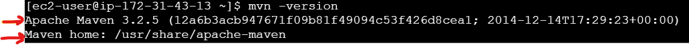
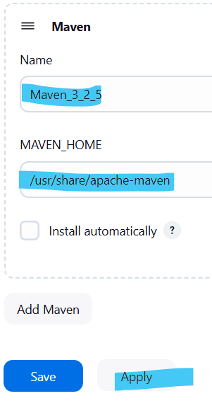
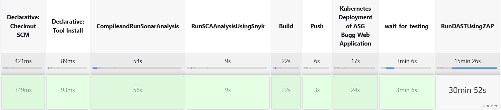
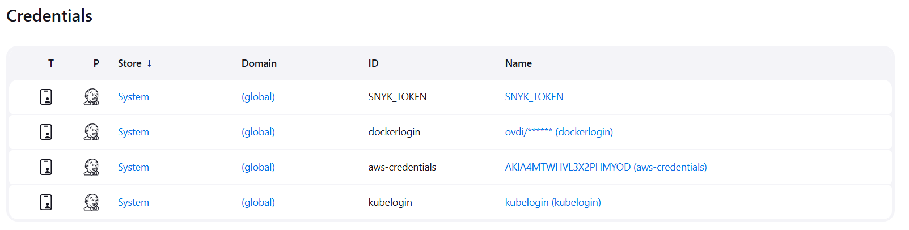
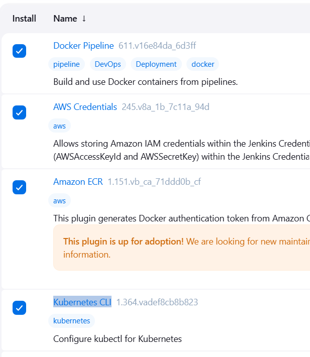
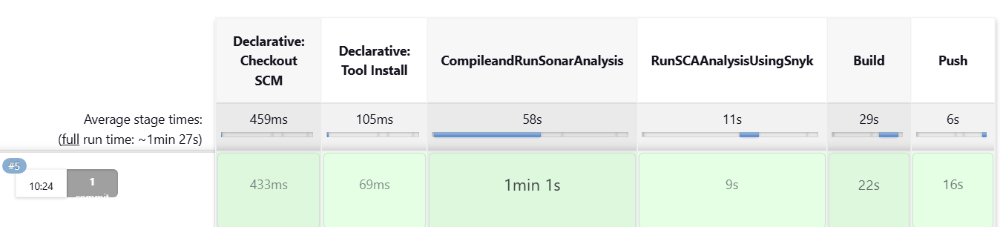

# AWS Infrastructure Creation using Terraform by A Security Guru

Helpful Terraform Links:
- [Terraform Language Documentation](https://www.terraform.io/docs/language/index.html)
- [Resource: aws_security_group](https://registry.terraform.io/providers/hashicorp/aws/latest/docs/resources/security_group)
- [Resource: aws_instance](https://registry.terraform.io/providers/hashicorp/aws/latest/docs/resources/instance)

## Step 0: Initialize Terraform
```
terraform init
```

## Step 1: Plan Resources
```
terraform plan -var-file="vars/dev-west-2.tfvars"
```

## Step 2: Apply Resources
```
terraform apply -var-file="vars/dev-west-2.tfvars"
```

## Step 3: Commands to get the Jenkins admin password via command line
```
chmod 400 <keypair>
ssh -i <keypair> ec2-user@<public_dns>
sudo cat /var/lib/jenkins/secrets/initialAdminPassword
```
## Some Useful Commands
```
#To get context information of kubernetes cluster
cat /home/ec2-user/.kube/config 

#To create namespace in kubernetes cluster
kubectl create namespace test

#To get deployments in a namespace in kubernetes cluster
kubectl get deployments --namespace=test 

#To get services in a namespace in kubernetes cluster
kubectl get svc --namespace=test 

#To delete everything in a namespace in kubernetes cluster
kubectl delete all --all -n test 

#To delete unused docker images to cleanup memeory on system 
docker system prune  

#To delete a docker image
docker image rm imagename  

#To Create EKS cluster
eksctl create cluster --name kubernetes-cluster --version 1.25 --region us-west-2 --nodegroup-name linux-nodes --node-type t2.xlarge --nodes 2 

#To Delete EKS cluster
eksctl delete cluster --region=us-west-2 --name=kubernetes-cluster #delete eks cluster
```

## Step 4: Cleanup Terraform Resources
```
terraform destroy -var-file="vars/dev-west-2.tfvars"

#  ================================
    terraform plan -var-file="vars/dev-west-2.tfvars"
    terraform apply -var-file="vars/dev-west-2.tfvars"
    chmod 400 <keypair>
    ssh -i <keypair> ec2-user@<public_dns>
    sudo cat /var/lib/jenkins/secrets/initialAdminPassword









# jenkins plugin
    -Docker Pipeline
    -AWS Credentials
    -Amazon ECR
    -Kubernetes CLI


    https://github.com/bestdevopsengineer/2devsecops-jenkins-k8s-tf-sast-sonarcloud-repo.git

    snyk key= b40b576f-5568-416b-8abc-35227402387e



# To Create EKS cluster
    eksctl create cluster --name kubernetes-cluster --version 1.25 --region us-west-2 --nodegroup-name linux-nodes --node-type t2.xlarge --nodes 2 

    kubectl get nodes
    kubectl create namespace devsecops
    cat /home/ec2-user/.kube/config #paste into a file name kubelogin , add jenkins credentials[secret file]
    #dont forget to open port 80 to access the loadbalancer
    eksctl delete cluster --region=us-west-2 --name=kubernetes-cluster 
    terraform destroy -var-file="vars/dev-west-2.tfvars"

    if you got some issues during deleting
    To delete security group use :
    aws ec2 delete-security-group --group-name jenkins_sg

    To delete instance profile use :
    aws iam delete-instance-profile --instance-profile-name test_profile
